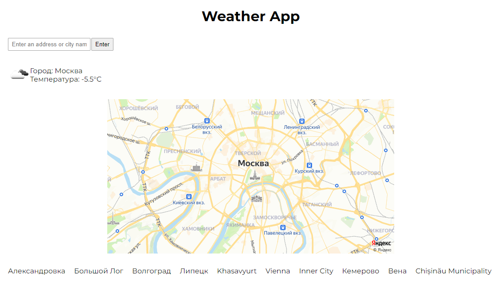

# OTUS Weather App

The OTUS Weather App is a single-page application for getting the weather forecast for a specific location.
First, the OTUS Weather App determines your location by IP address, and then shows the current weather forecast.
The OTUS Weather App will also store the last 10 locations you requested weather for.
You can use the input field or select a history item to request a weather forecast for the location you need.

#### The OTUS Weather App uses third party services such as:

- [GeoJS](https://geojs.io)
- [Open Weather Map](https://openweathermap.org/current)
- [Yandex Static API](https://yandex.ru/dev/maps/staticapi/doc/1.x/dg/concepts/input_params.html)

  

